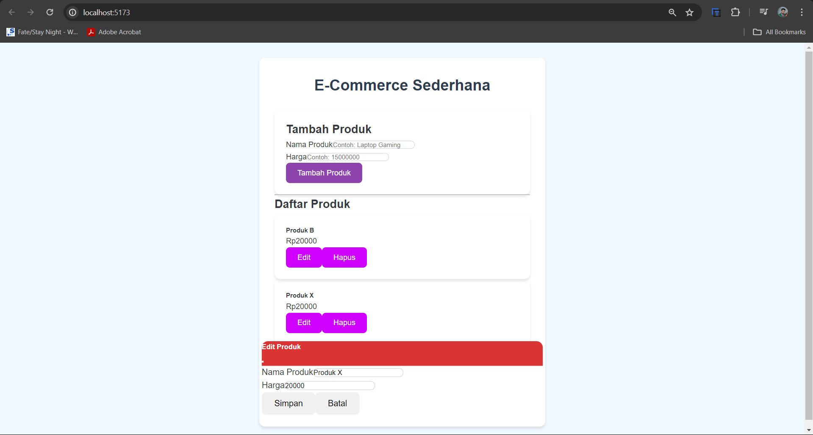

# **E-Commerce Sederhana**

## **Deskripsi**
📖 Aplikasi ini adalah sebuah sistem manajemen produk sederhana dengan fitur **CRUD (Create, Read, Update, Delete)** lengkap. Dibangun menggunakan teknologi modern seperti **React (Vite)** untuk frontend, **Express.js** untuk backend, dan **PostgreSQL** sebagai database. Aplikasi ini dirancang untuk membantu pengguna mengelola daftar produk dengan mudah.

Fitur utama:
- **Tambah Produk**: Pengguna dapat menambahkan produk baru.
- **Lihat Daftar Produk**: Menampilkan daftar produk dalam format tabel/card.
- **Edit Produk**: Pengguna dapat memperbarui informasi produk.
- **Hapus Produk**: Pengguna dapat menghapus produk dari daftar.
- **Notifikasi Toastr**: Memberikan feedback sukses atau gagal setelah setiap aksi.
- **Validasi Input**: Memastikan data yang dimasukkan valid sebelum disimpan.
- **Desain Responsive**: Tampilan dioptimalkan untuk perangkat desktop dan mobile.

---

## **Cara Instalasi**
### 1. Prasyarat
Sebelum menjalankan aplikasi, pastikan Anda telah menginstal:
- **Node.js** (Versi: v22.13.1)
- **PostgreSQL**
- **Git**

### 2. Clone Repository
```bash
git clone <link-repository-anda>
```

### 3. Masuk ke Folder Aplikasi
```bash
cd nama-folder-aplikasi
```

### 4. Install Dependensi
```bash
npm install
```

---

## **Cara Menjalankan Aplikasi**

### **Backend**
1. Masuk ke folder backend:
   ```bash
   cd ecommerce-backend
   ```
2. Pastikan PostgreSQL sudah berjalan dan database `ecommerce-kecil` sudah dibuat.
3. Konfigurasikan database di file `db.js`:
   ```javascript
   const pool = new Pool({
     user: 'postgres',
     password: '2376',
     host: 'localhost',
     port: 5432,
     database: 'ecommerce-kecil'
   });
   ```
4. Jalankan server backend:
   ```bash
   node index.js
   ```
   Backend akan berjalan di `http://localhost:3001`.

### **Frontend**
1. Masuk ke folder frontend:
   ```bash
   cd ecommerce-frontend
   ```
2. Jalankan aplikasi frontend:
   ```bash
   npm run dev
   ```
   Frontend akan berjalan di `http://localhost:5173`.

---

## **Endpoint API**
API tersedia di `http://localhost:3001`:

| **Method** | **Endpoint**         | **Fungsi**                  |
|------------|----------------------|-----------------------------|
| GET        | `/produk`           | Mendapatkan semua produk    |
| POST       | `/produk`           | Menambahkan produk baru     |
| PUT        | `/produk/:id`       | Memperbarui produk          |
| DELETE     | `/produk/:id`       | Menghapus produk            |

Contoh body request untuk POST/PUT:
```json
{
  "nama": "Nama Produk",
  "harga": 100000
}
```

---

## **Struktur Direktori**
### Backend (`ecommerce-backend`)
- `index.js`: Entry point backend.
- `db.js`: Konfigurasi koneksi database PostgreSQL.
- `routes/`: Berisi definisi endpoint API.

### Frontend (`ecommerce-frontend`)
- `src/components/`: Komponen React seperti `ProdukList.jsx`, `TambahProduk.jsx`.
- `App.jsx`: File utama frontend.
- `index.css`: Styling global aplikasi.

---

## **Database Schema**
Tabel `produk` memiliki struktur sebagai berikut:

| **Kolom** | **Tipe Data** | **Keterangan**       |
|-----------|---------------|----------------------|
| id        | SERIAL        | Primary Key         |
| nama      | VARCHAR       | Nama produk         |
| harga     | INTEGER       | Harga produk        |

---

## **Screenshot Aplikasi**
Berikut adalah tampilan aplikasi saat dijalankan:

1. **Halaman Ecommerce Sederhana**:
   
---

## **Troubleshooting**
🛠 Jika Anda mengalami masalah:
- **CORS Error**:
  - Pastikan backend sudah menggunakan middleware `cors`:
    ```javascript
    app.use(cors());
    ```
- **Database Connection Error**:
  - Pastikan PostgreSQL sedang berjalan.
  - Cek kredensial di `db.js`.
  - Pastikan database `ecommerce-kecil` sudah dibuat.

---

## **Penulis**
- **Nama**: Adonia Azarya Tamalonggehe (10231007) & Chelsy Olivia (10231025)
- **GitHub**: [Link Github](https://github.com/Adonia76/ChelDon)

---

## **Inspirasi Hari Ini**
🌟 “Mengetahui saja tidak cukup; kita harus menerapkannya. Berkeinginan saja tidak cukup; kita harus melakukannya.” – Goethe

---